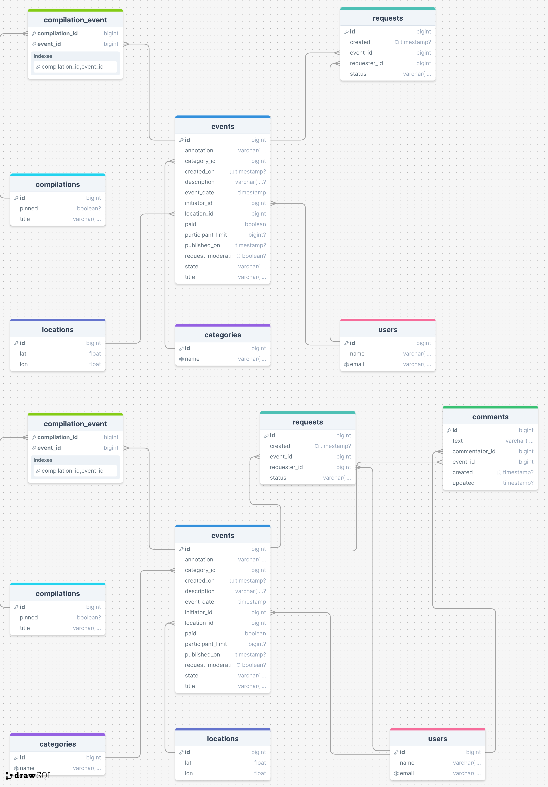

# java-explore-with-me

## Архитектура

Сервис состоит из двух приложений
- основное приложение
- сервис статистики просмотров

### Основной сервис

API основного сервиса разделён на три части:
* Публичная, доступна без регистрации любому пользователю сети.
* Закрытая, доступна только авторизованным пользователям.
* Административная, для администраторов сервиса.

#### Публичное API:

* Сортировка списка событий по количеству просмотров либо по датам событий.
* Просмотр подробной информации о конкретном событии.
* Есть возможность получения всех имеющихся категорий и подборок событий (такие подборки могут составлять администраторы ресурса).
* Каждый публичный запрос для получения списка событий или полной информации о мероприятии фиксируется сервисом статистики.

#### Закрытое API:

* Пользователи могут добавлять в приложение новые мероприятия, редактировать их и просматривать после добавления.
* Могут подавать заявки на участие в интересующих мероприятиях.
* Создатель мероприятия имеет возможность подтверждать заявки, которые отправили другие пользователи сервиса.

#### Административное API:

* Добавление, изменение и удаление категорий для событий.
* Возможность добавлять, удалять и закреплять на главной странице подборки мероприятий.
* Модерацию событий, размещённых пользователями, — публикация или отклонение.
* Управление пользователями — добавление, просмотр и удаление.

### Сервис статистики

Призван собирать информацию о количестве обращений пользователей к спискам событий и о количестве запросов к подробной информации о событии.

#### **Реализация комментариев:**

* **Добавление комментариев:** Пользователи могут оставлять комментарии к опубликованным событиям.
* **Редактирование комментариев:** Пользователи могут редактировать свои комментарии.
* **Удаление комментариев:** Пользователи могут удалять свои комментарии. Администраторы могут удалять любые комментарии.
* **Просмотр комментариев:** Доступны функции для просмотра комментариев к событиям, а также для просмотра комментариев конкретного пользователя.

## Использованные технологии:

* Spring Boot
* Maven
* Lombok
* JPA
* Hibernate
* PostgreSQL
* Docker

### Схема
